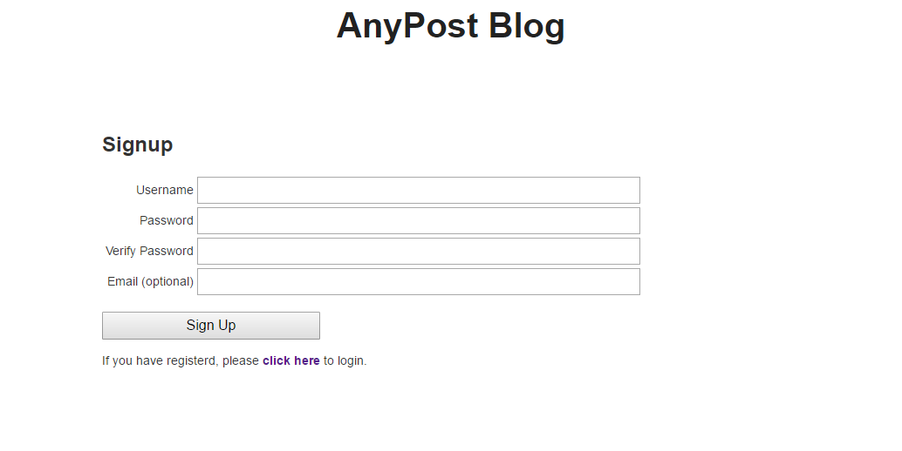

# Multi User Blog 

This project is a python example for blog system(application) using Google App Engine.
And it used the template engine which is jinja 2 ( http://jinja.pocoo.org/ ).

If user registered in this system, user could login & write posts.
Each post has a unique key which could use with url.

Core Feature
-------

- Front page that lists blog posts
- Have a registration form
- Have a login form
- Have a logout form
- Users should only be able to edit/delete their posts

Sample Site URL ( Temporary Operation ) 
---------------

https://norse-blade-166616.appspot.com

Page Tree Structure
--------------

    /welcome                    : link to login or signup

    /user/signup                : register user to blog system -> /welcome
    /user/login                 : login to blog system

    /blog/                      : shows all blog
    /blog/[1234]                : shows each blog with unique blog key
    /blog/[1234]/like           : add like count by blog key
    
    /blog/newpost               : new post to save 
    /blog/editpost/[1234]       : edit post by blog key
    /blog/deletepost/[1234]     : delete post by blog key

    /blog/newcomment/[1234]     : new comment to save
    /blog/editcomment/[1234]    : edit comment by comment key
    /blog/deletecomment/[1234]  : delete comment by comment key

    /user/logout : redirect to /welcome page
        
Source Directoy
---------------

    /           : main route code
    /static     : css code
    /templates  : html template code 
    /module     :  use and blog request handling code

Setup for this project ( from udacity.com ) 
-------------------------------------------

    - Install Python if necessary
    - Install Google App Engine SDK.
    - Sign Up for a Google App Engine Account 
    - Create a new project in Google's Developer Console in unique name
    - When developing locally, you can use dev_appserver.py to run a copy of your app 
      on your own computer, and access it at http://localhost:8080/.
        $ dev_appserver.py app.yaml
    - Deploy your project with gcloud app deploy.
        $ gcloud app deploy [--version = VERSION, -v VERSION]

Screen Shot - signup
----------------------

